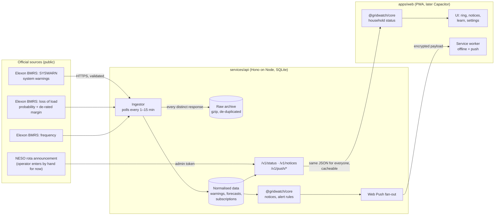

# Architecture

## Components and data flow

### Why it's shaped like this

- **One status document for everyone.** `/v1/status` is identical for every user, so it can sit behind a CDN, and it reveals nothing about who asked. Each device applies its own rota letter on the device (`assessPersonal` in `@gridwatch/core`).
- **Shared rules.** What the app shows and what the server pushes come from the same code: `status.ts` for display and `alerts.ts` for push. They can't drift apart.
- **The archive comes first.** Every distinct raw response is kept, compressed. That history becomes the training data for local fault forecasting, and it lets us re-run the parsers when wording changes.
- **Honest freshness.** Each source reports its last successful fetch. The app shows "Checking" after 20 minutes without a critical source, and says it can't confirm after 3 hours.

## The household status

`assessPersonal(snapshot, prefs, now)` returns one of five levels, in this order of precedence:

1. **Rotation in force.** If the user's block is off now, the level is **Power off**. If it is off within 12 hours, **Get ready**; if later, **Heads-up**. If the block isn't scheduled, **Heads-up**. If no letter is set, **Get ready**, with a prompt to add one.
2. **Demand Control Imminent**: **Get ready**.
3. **High Risk of Demand Reduction**: **Heads-up**.
4. **Margin notice or Capacity Market Notice**: **All clear**. The national grid is shown at level 1, with an explanation.
5. **Nothing in force**: **All clear**.

If the critical feed is more than 3 hours old, the level is **Checking** ("We can't confirm right now") instead.

## Alert rules

`alertFor(event, prefs, now)` in `packages/core/src/alerts.ts`:

| Event | Only when I need to act | Heads-ups too (default) | Every grid notice |
|---|---|---|---|
| Margin or capacity notice | – | – | yes |
| High risk of demand reduction | – | yes | yes |
| Demand control imminent | yes | yes | yes |
| Rota announced: my block scheduled, or no letter set | yes | yes | yes |
| Rota announced: my block not scheduled | – | yes | yes |
| Cancellation of anything above | same as the original | same as the original | same as the original |

- Each subscriber gets each event once, even if it is replayed (the `deliveries` table).
- Events already more than 2 hours old when first seen (for example, after a restart) are recorded but not pushed.

## Deployment options

- **Static site:** any host that honours `_headers` (Cloudflare Pages, Netlify), or a CDN with the same headers.
- **API:** any Node 22 host with a persistent disk (Fly.io, Render, a small VM), in a UK or EU region. The code uses web-standard APIs through Hono, so moving to Cloudflare Workers means swapping `Store` for D1/R2 and `web-push` for a WebCrypto implementation.
- **Ingestion:** runs in the API process by default (`INGEST=on`). With more than one instance, run it once elsewhere (a scheduled job calling the same `Ingestor` methods) and set `INGEST=off` on the web-facing instances.

## What's next

1. Verify the Elexon adapters against the live API (`ingest:once`), then deploy and start archiving.
2. Add network operator feeds for live faults and planned outages. This is when outward postcodes come in.
3. Build a local storm-risk model from the archive and weather forecasts, for winter 2027/28.
4. Add native shells with Capacitor, with FCM and APNs push.
5. Add a pre-window reminder: an alert 60 minutes before the user's block goes off.
